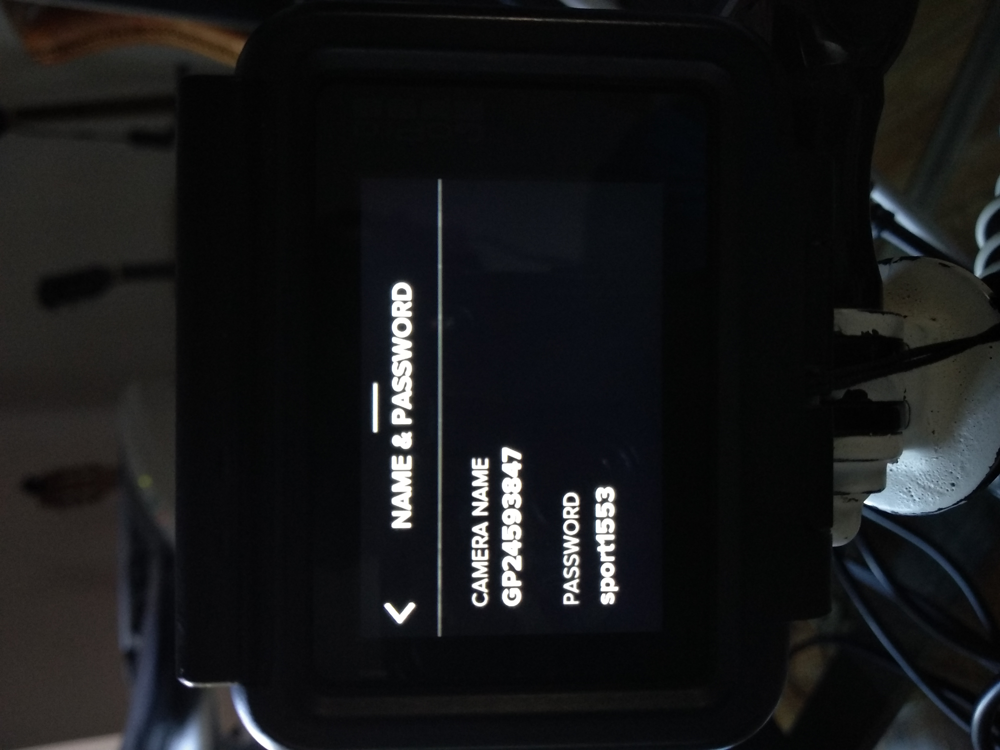
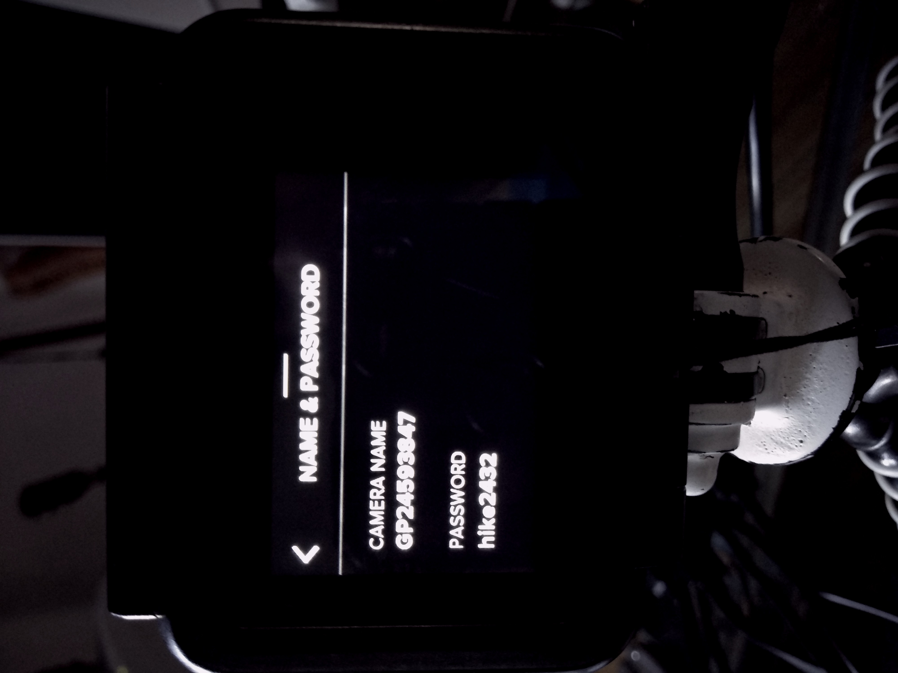
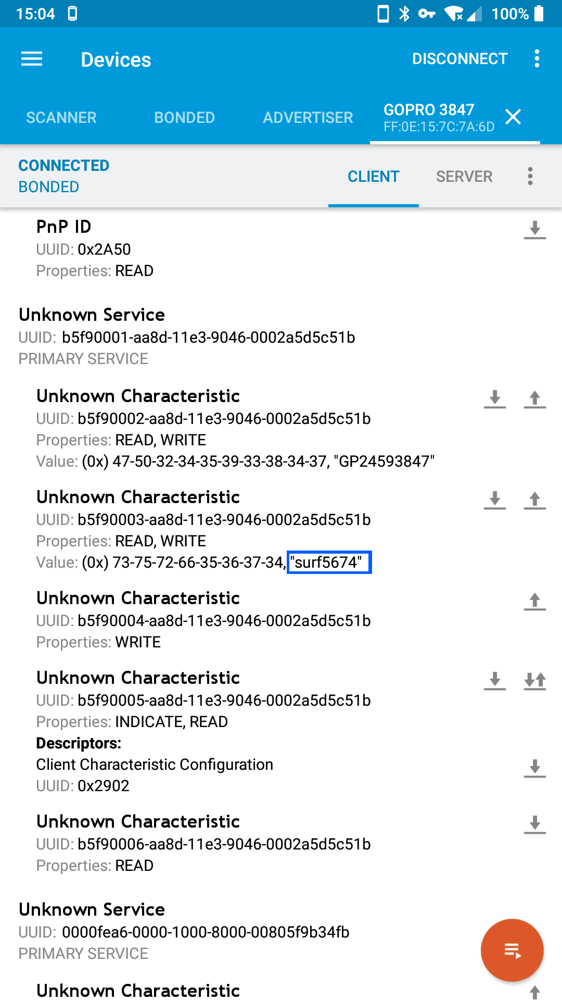
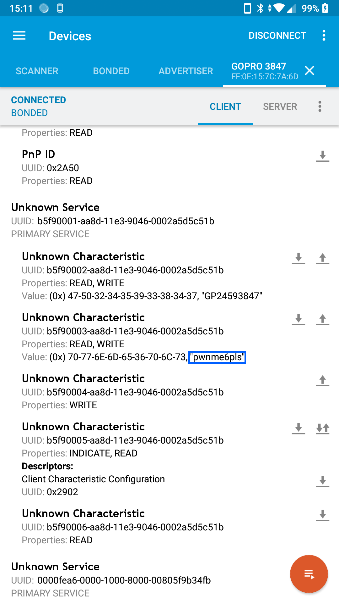
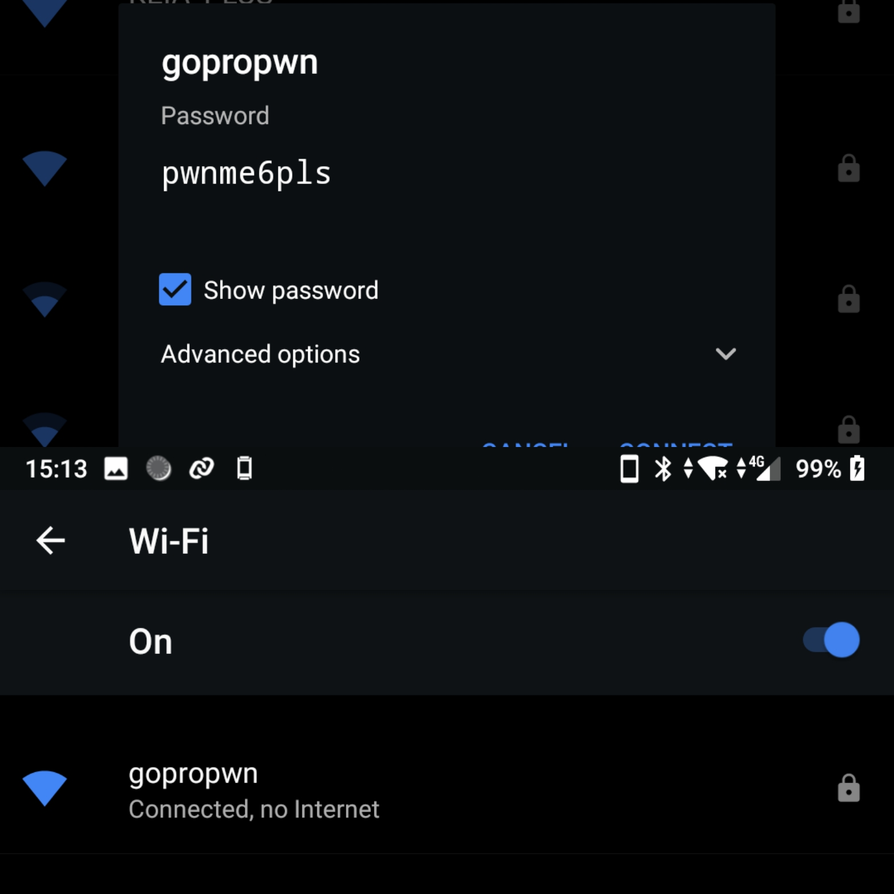

# Cracking Auto-Generated Pseudorandom Passwords On GoPro Camera

...and getting them through Bluetooth

## File Index:

| File                             | Description |
|----------------------------------|-------------|
| code/Bluetooth_Password_Fetch.py | Bluetooth Password Exploit Python code |
| code/Bluetooth_Password_Change.py| Python code to change the WiFi Password when via Bluetooth when the camera is pairing |
| code/Calculate_Guess.go          | GoLang code to calculate time to guess WiFi password |
| code/Generate_Password.py        | Python implementation of GoPro Default Password Cracking |
| code/GoPro_Password_Change.sh    | Utility to change the WiFi SSID and Password with physical access to SD card |
| /GoPro_Request.txt               | Letter I sent to GoPro |

## Who wrote this:

- Konrad Iturbe 
	- Android Developer for several companies
	- worked with consumer technologies in industrial scenarios for the last 5 years
	- makes: goprowifihack (GoPro unofficial WiFi API), autoexechack, etc...
	- github.com/konradit && twitter.com/konrad_it

## Preface:

For simplicity's sake, some companies have moved from offering customisable passwords on services/devices to randomly generating one.
One such case is action camera company GoPro, their cameras offer WLAN AP for live streaming, camera control and media offload. Aforemented AP is protected by a password. WLAN AP is WPA2 protected with a static 10.5.5.9 address.
From 2016 onwards, GoPro has removed the capability of adding your own password to your camera. 

GoPro cameras sometimes are used in military, government and confidential scenarios^1. The WiFi AP needs to be secure. This paper will outline some of the **risks associated with having a password derived from a template** and **how to solve these issues**, as well as demonstrate password leakage through bluetooth.

GoPro has been notified of these issues, a report was sent on August 20.

## Pseudorandom password generation:

| Step 1                              | Step 2                              |
|-------------------------------------|-------------------------------------|
|  |  |

GoPro WiFi passwords have the following structure:

[word] + [4 numbers]

Words are stored in an internal dictionary.

Numbers can be repeated, range is 0 to 9.

## Cracking Password Methodology:

- **Swipe menu**:

An attacker with physical access to the camera can get the WiFi SSID and Password from the camera itself, the information is shown in the camera settings.

This is shown in [Password_Generation.mp4](videos/Password_Generation.mp4).

- **Bluetooth**:

GoPro cameras advertise themselves via Bluetooth to pair with the Smartphone app. 

When the camera is pairing to the smartphone app, an attacker can connect to it via Bluetooth and see the WiFi Password and SSID. From there an attacker could connect to the camera via the WiFi HTTP API^2 and get a live stream, delete or download media or start recording and take pictures. The attacker can also change the WiFi SSID and Password via Bluetooth because the characteristics are read/write.

The service in question is "b5f90001-aa8d-11e3-9046-0002a5d5c51b", from there the WiFi SSID is advertised in "b5f90003-aa8d-11e3-9046-0002a5d5c51b" and the Password in "b5f90002-aa8d-11e3-9046-0002a5d5c51b".

This is how the camera advertises when pairing.

|  |  |  |
|----------------------------------|----------------------------------|----------------------------------|

I've developed an Proof-of-Concept in Python which connects to any GoPro via Bluetooth when pairing, then gets the WiFi SSID and WiFi Password, uses that to connect to it via WiFi, then commands the camera to take a picture and also prints the WiFi SSID, Password and Camera Serial Number.

[Proof of Concept Python Code](videos/Bluetooth_Password_Fetch.py)

[Video Demo](videos/BT_Demo_720p.mp4)

Because the Bluetooth characteristic is writable this code can also change the password via Bluetooth: [Proof of Concept Python Code for changing password](code/Bluetooth_Password_Change.py).

- **Word Dictionary**:
	
To get an idea of the words used in a GoPro password, I cycle through multiple WiFi Resets and compile a list of words used in password generation. Easier way is to decompile the firmware and get the dictionary used, attempt failed.

Another method is to use an existing dictionary of words: https://raw.githubusercontent.com/dwyl/english-words/master/words_dictionary.json

The structure of the password is: [word] + [4 numbers].

This Python code generates a GoPro-like Password and attempts to connect to the camera: [Generate_Password](code/Generate_Password.py)

Part 1 generates a random word, part 2 generates a random 4 digit number.

For random words, I observed that GoPro uses sports or words related to sports and outdoor activities, I used a list of sports^3 as well as some of the words I collected.

Here is a table of attempts to guess the password on a GoPro Hero5 using an Intel Core i5-4210U:

password: dive6569

using gopro_words dictionary: 131 seconds, 640 seconds.

using dictionary2: after 18000 the program was unsuccessful.

- **Minor detail**:

When first setting up a GoPro Hero 5 or later, you will be prompted to pair it with your smartphone. 

After this wifi can be used freely without needing to pair it to a new device. Older GoPros (eg: HERO4) needed a PIN CODE to pair with a new device.

## Mitigating: 

Change password & ssid:

The WiFi SSID and Password can be changed in two ways:

Via Bluetooth using [Bluetooth_Password_Change.py](code/Bluetooth_Password_Change.py)

This will change the SSID to "PwnedHero5" and the password to "CameraPwned".

A script can be placed in the root of the SD card, akin to autoexec.ash, which will also change the SSID and password. A program to generate such script is: [GoPro_Password_Change.sh](code/GoPro_Password_Change.sh).

The WiFi SSID and password can be seen on the CONNECT > Name & Password menu.

Turn WiFi off when not in use.

## Recommendations to GoPro:

GoPro cameras, as previously mentioned are used in several high risk and confidential scenarios where content integrity and security is a top priority. GoPro should adopt some security measures shown below:

- Let uses change their WiFi and Password: If the camera is identified it should also change the WiFi SSID after a reset. Users should choose a strong password. WiFi SSID can make the camera less attractive.
- Have more security when resetting the camera: eg: a passcode.
- Have a passcode required to pair with new devices: this passcode should be entered into the camera when connecting to a new device and resetting the camera. This passcode should be stored cryptographically in the camera internal memory.
- Bring back code pairing and blue WiFi LEDs from Hero4 camera generation: This provides more security when pairing (so only owners of the camera can pair with it due to the pin code), and users will know when the WiFi is on.
- Require passcode when showing WiFi SSID and Password in the camera.
- Don't advertise the WiFi SSID and Password via bluetooth

## Importance of strong security in IoT WiFi devices:

GoPro cameras are paired to the respective smartphone, if an attacker can connect to the same WiFi AP as the smartphone (the AP being the GoPro camera) a multitude of attacks can be exploited on the smartphone (eg: metasploit payload upload, snoop attempts to make HTTP requests by other applications, MITM attacks).

As well as get footage from the camera or a live feed used for spying.^4

Other camera manufacturers such as Xiaomi Yi and DJI let users change the WiFi SSID and Password.

## Credits, references & end notes:

1. http://chernowii.com
2. https://github.com/konradit/goprowifihack
3. https://www.britannica.com/topic/list-of-sports-2038581
4. https://www.bbc.co.uk/news/av/technology-32934083/gopro-cameras-could-be-used-to-spy-on-owners

Watch this space: https://github.com/konradit/GoProWirelessPassword

- Credits: zibri, evilwombat, hostile, infosec twitter, gopro
- See more GoPro stuff: github.com/konradit
- Questions? twitter.com/konrad_it, mail AT chernowii DOT com
